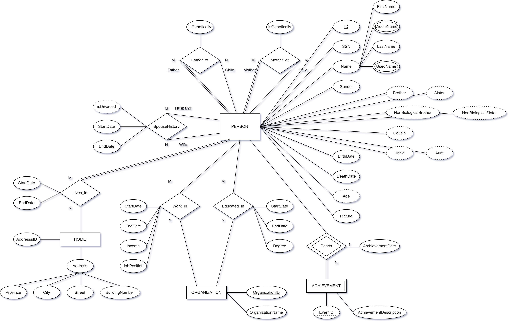

# Family Tree Database Project Report

## Project Description

We would like to create a database to store information about family members, including:

- Personal information
- Work history
- Education history
- Marriage history (date of marriage, divorce, remarriage, etc.)
- Children

## Assumptions about Cardinality and Participations

- Store the name, date of birth, picture, and date of death for each family member.
  - Each member has a unique ID.
- Store relationships between members, such as father, mother, children, sister, brother, uncle, aunt, and cousins.
  - Non-genetic relationships are also possible.
  - The type of relation should indicate whether it is biological.
- Store the education history of each person in the database.
  - Education history includes only government-recognized education and may exclude optional programs such as afternoon schools.
- Store the work history of each person in the database.
  - A family member can have multiple work history records, including time period, job position, and income.
  - Not all family members may have work history.
- Store the places (addresses) where a person lived during their lifetime.
  - This excludes non-house living situations such as homelessness or living in a car.
- Store the full marriage history of a person, including divorces and remarriages.
  - Each marriage record includes date of marriage, divorce and remarriage information, and spouse.
  - Marriage is optional; not all members are married.
  - A person can be married to at most one person at a time.
  - A person may have children from different marriages.
  - A person may have step-brothers, step-sisters, half-brothers, or half-sisters.
- Store major achievements or special life events for family members, such as university graduation or being elected CEO of a company.
  - A person can have multiple events, each with a type and date.
  - A person can attend other family members’ events.

## EER Modeling Diagram



## ER-Model Mapping to Database Relational Schema

### Regular entities

```text
Person (PersonID, SSN, FirstName, LastName, Sex, BirthDate, DeathDate, Picture)
Home (AddressID, Province, City, Street, BuildingNumber)
Organization (OrganizationID, OrganizationName)
```

### Weak entities

```text
Person_Achievement (PersonID, ArchievementID, Type, Date) // 1:N relationship
```

### M:N relationships

```text
Person_LivesIn_Home (PersonID, AddressID, StartDate, EndDate)
Person_EducatedIn_School (PersonID, OrganizationID, StartDate, EndDate, Degree)
Person_WorkedIn_Company (PersonID, OrganizationID, StartDate, EndDate, JobPosition, Income)
```

### Recursive relationships

```text
Father_FatherOf_Child (Father_PersonID, Child_PersonID, Type)
Monther_MontherOf_Child (Monther_PersonID, Child_PersonID, Type)
Husband_SpouseOf_Wife (Husband_PersonID, Wife_PersonID, StartDate, EndDate)
```

### Multivalued attributes

```text
Person_MiddleName (PersonID, MiddleName)
Person_UsedName (PersonID, UsedName)
```

## Normalization

[Details can be found here](normalization.pdf)
